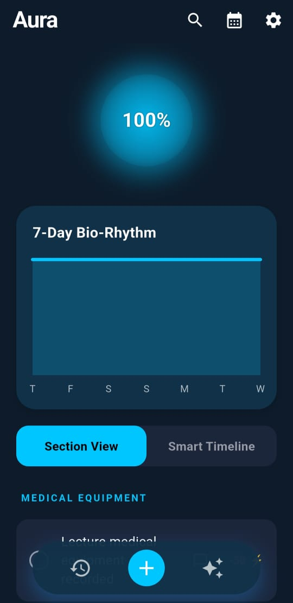
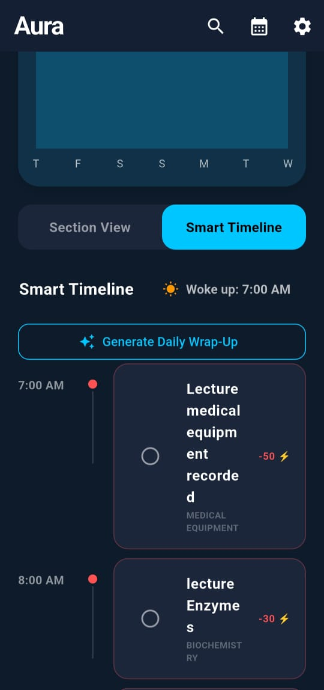
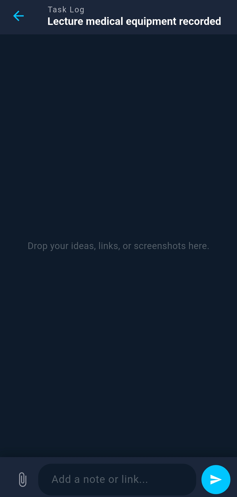

# Aura-App-Showcase

Aura is not just a to-do list; it is a personal energy engine. Designed with a strict "Dark Mode Only" aesthetic and an immersive full-screen UI, Aura helps users manage their physiological capacity to do work, avoid burnout, and seamlessly track their daily tasks.

---

## 📖 Overview

Traditional productivity apps track time, but Aura tracks **energy**. By combining task management with a dynamic "Daily Aura" energy meter, the app visualizes your capacity in real-time. Complete draining tasks to see your energy dip into the warning zones, and use the built-in focus tools to recharge and protect your peace. 

## ✨ Key Features

* 🔋 **Dynamic Energy Tracking:** A real-time, state-driven chart that shifts colors (from High-Energy Blue to Burnout Red) based on your daily activity load.
* ⏱️ **Smart Timeline:** A beautifully formatted, auto-sorting daily schedule that visualizes when tasks happen, integrated with local timezone data.
* 💬 **Private Task Threads:** Treat every task like a chat room. Add notes, logs, and upload image attachments (powered by ImgBB) to keep context isolated.
* 🍅 **Focus Engine:** Built-in Pomodoro timers designed to run in immersive mode for pure distraction-free deep work.
* 📲 **Viral Daily Wrap-Up:** Automatically generates a shareable "Daily Aura" summary card that users can instantly post to Instagram or WhatsApp.
* 📴 **Offline-First Architecture:** Powered by Firestore's local caching, so your timeline works perfectly even without Wi-Fi.

---

## 🛠️ Tech Stack & Architecture

Aura is a full-stack mobile application built with the Flutter framework and a robust backend.

**Frontend:**
* **Framework:** Flutter (Dart)
* **UI/UX:** Native Immersive Mode (`SystemChrome`), dynamic flexible layouts (`MediaQuery` & `Expanded`), Custom SVG/Canvas drawing.
* **Data Visualization:** `fl_chart` for responsive mathematical line graphing.

**Backend & Services:**
* **Database:** Firebase Cloud Firestore (NoSQL)
* **Authentication:** Firebase Auth
* **Image Hosting:** External ImgBB API (via `http` package) to optimize storage costs.
* **Local Services:** `flutter_local_notifications` and `timezone` for scheduled background alerts.

---

## 📱 Interface Sneak Peek

| Dashboard & Energy | Smart Timeline | Task Threads |
| :---: | :---: | :---: |
|  |  |  |

---

## 🔒 Source Code Notice

This repository serves as a public showcase of the Aura application's UI/UX, database architecture, and feature set. The actual source code is kept strictly private to protect intellectual property. 

*If you are a recruiter or technical lead interested in discussing the codebase, architecture patterns, or offline-first implementation, please feel free to reach out via my GitHub profile.*
# 🌌 Aura: Protect Your Peace. Master Your Time.

---

## 👤 Author

**Developed by Jana**
* Bridging the gap between intelligent systems and human productivity.
* **GitHub:** [@janawaleed135](https://github.com/janawaleed135)

---
*Made with ⚡ and Flutter.*
